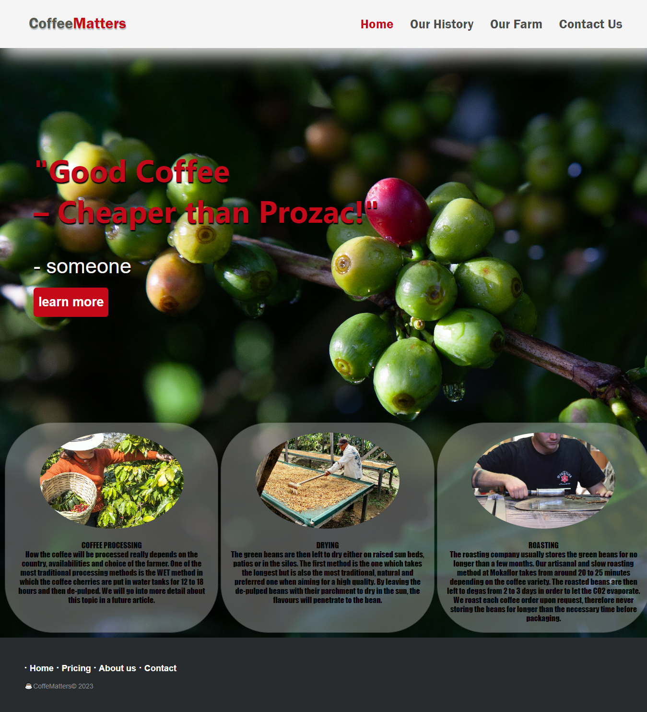

# vanilla-js-pro1

في هذا المشروع سوف نقوم بعمل موقع تعريفي  باستعمال +`Html`+`Css`بالاضافة الى `Bootstrap` متطلبات المشروع :
* قم بعمل صفحة رئيسية للموقع .
* قم بإضافة `navbar` & `footer` للصفحة رئيسية .
* أضف خيار التنقل بين صفحات الموقع في `navbar` .
* قم بعرض ثلاث بطاقات تعريفيه في الموقع .
لليكون العمل مشابه للصوره التالية :

# vanilla-js-pro2

